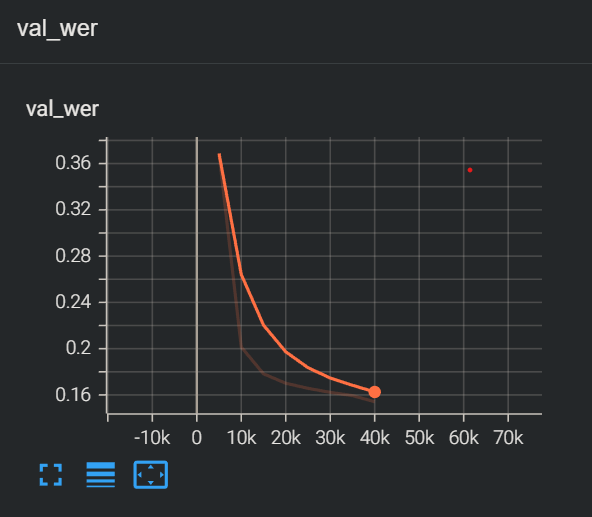

## 🚀 Fine-tuning Guide for ASR Model with Vocabulary Expansion

This guide outlines the steps required to fine-tune the pre-trained ASR model (e.g., Parakeet TDT-110M) by optionally merging its existing English vocabulary with new language tokens.

### Prerequisites

* NVIDIA NeMo Toolkit installed:
    ```bash
    uv venv
    source .venv/bin/activate
    cd NeMo-2.4.0
    uv pip instll -e '.[asr]'
    ```
* Your new tokenizer model (`.model` and `.vocab` files) prepared (e.g., located in `./en1024_hi256`).
* Your training data manifest files ready.
* **Environment Tested on:**
    * **python:** `3.10.12`
    * **PyTorch:** `2.8.0`
    * **CUDA:** `12.8`

### Step 1: Tokenizer Model Merging (`merge_token.py`) (Optional)

If you want to **preserve the model's original English capabilities** while adding new language tokens, you should merge the original English SentencePiece model with your newly trained model.

* **Script:** `merge_token.py` (Assuming this is your merging script).
* **Purpose:** Combines the English tokens and the new tokens into a unified vocabulary, ensuring the merged model can handle both languages effectively.

```bash
# Example command (adjust paths as necessary)
uv run merge_token.py 
```

### Step 2: Configure YAML Configuration
Before running the fine-tuning script, adjust the **manifest_filepath** and **training parameters** in your configuration file (ft_110M_enhi.yaml).

* File: ft_110M_enhi.yaml

* Adjustments Required:

    1. Update the manifest file paths (manifest_filepath) under model.train_ds, model.validation_ds, and model.test_ds to point to your data.

    2. Review and set the trainer parameters (trainer block), such as max_epochs, devices, accelerator, etc.

### Step 3: Run the Fine-tuning Script (ft_110M_enhi_demo.py)
Execute the main fine-tuning script. This script loads the model, integrates the new vocabulary, transfers weights, and starts training.

### 🔸 Scenario A: With Merged Tokenizer (Recommended for Multilingual)
If you performed Step 1 (Merging), the script must contain the original weight transfer logic to re-assign the pre-trained English parameters to the corresponding indices in the newly expanded layers.

* Key Logic in Script: The script performs the original weight saving (e.g., ori_decoder_prediction_embed), calls asr_model.change_vocabulary(...), and then explicitly copies the weights of the old vocabulary ([:1024]) and special tokens ([-6:], [-1]) back into the expanded layers.

### 🔹 Scenario B: Without Merged Tokenizer (New Language Only)
If you are only replacing the tokenizer with a new language's model without merging:

* Key Logic in Script: Remove the weight saving and weight transfer logic (Sections 1 and 3 in the Python code). Keep only the model loading and the asr_model.change_vocabulary call.

### Optional: 8-bit Optimizer Support
If you are using a GPU with limited memory (e.g., RTX 4090) and wish to enable the 8-bit AdamW optimizer:

* Toggle: Set the bnb_optim flag to True at the beginning of the ft_110M_enhi_demo.py script.

* uv pip install bitsandbytes


## Result


## Note
This model was trained using a private dataset provided by https://huggingface.co/spaces/RinggAI/STT. The trained checkpoint (ckpt) will only be released with permission. However, the training script has been organized and includes 8-bit optimization (8-bit optim), which allows increasing the max_duration to achieve a higher batch size on a 24GB memory card.

Here are the observations on the model's prediction stage (character output) during my own training:
1. Initial stage: Outputs random characters.
2. Mute stage: No characters are output (up to 5k steps).
3. Basic vocabulary stage: Outputs basic characters (5k ~ 15k steps).
4. Major vocabulary stage: Outputs most characters (15k ~ 30k steps; at this point, the validation WER usually falls between 25% and 35%, depending on the language).
5. Convergence stage: The model starts to fully converge (100k ~ 150k steps). Based on the size of the corpus, if it's around 500 hours, training to about 150k steps is generally sufficient for convergence.


## 🚀 Roadmap

### 🟩 Done
- 8-bit optimizer integration
- Fix loss initialization bug  

### 🟧 In Progress
- replace encoder attention to bi-rwkv

### 🟥 Planned
- 